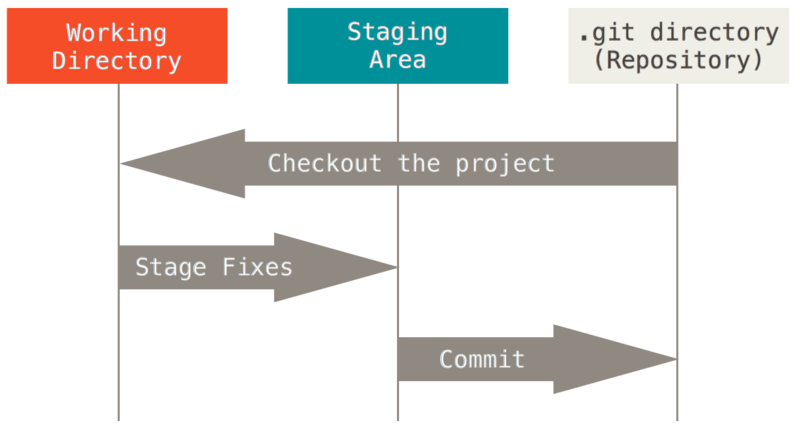

# Git에 사용법 정리

## Git의 구조

</br>



### Git은 기본적으로 3가지 구조로 이루어져있다.
1. Working Directory
   - 일반적인 작업을 하는 곳.
2. Staging Area
   - 데이터를 커밋을 하기 전에 있는 곳.
3. .git directory(Respository)
    - 데이터 커밋을 하게 될 경우 저장되는 곳.


</br>

## Git 명령어들 순서대로 할것들

```bash

    git config --global user.name
    git config --global user.email

    git init

    git status

    git add

    git commit -m "변경사유"

    git log

```

### Config
>누가 커밋을 했는지 알기 위해서 작성합니다. 초기설정이므로 한번만 하면 끝.

1. 커밋확인 확인 법
 
```bash
git config --global -l

git config --global --list

```

### Git status
>해당 명령어 입력시 기대할 수 있는 응답들
1. Untracked : Git이 관리하지 않는 파일
2. Tracked: Git이 관리하는 파일
    - Unmodified: 최신 상태
    - Modified: 수정되었지만 Staging Area에는 반영 안됨.
    - Staged: Staging Area에 올라간 상태.


